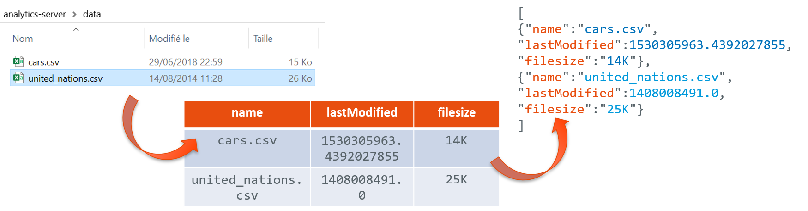

# Analytics server

A REST API to expose datasets
with Flask & connexion 

This is the data manipulation performed by the server:

## Inspiration
[https://realpython.com/flask-connexion-rest-api/#demonstration-single-page-application](https://realpython.com/flask-connexion-rest-api/#demonstration-single-page-application)