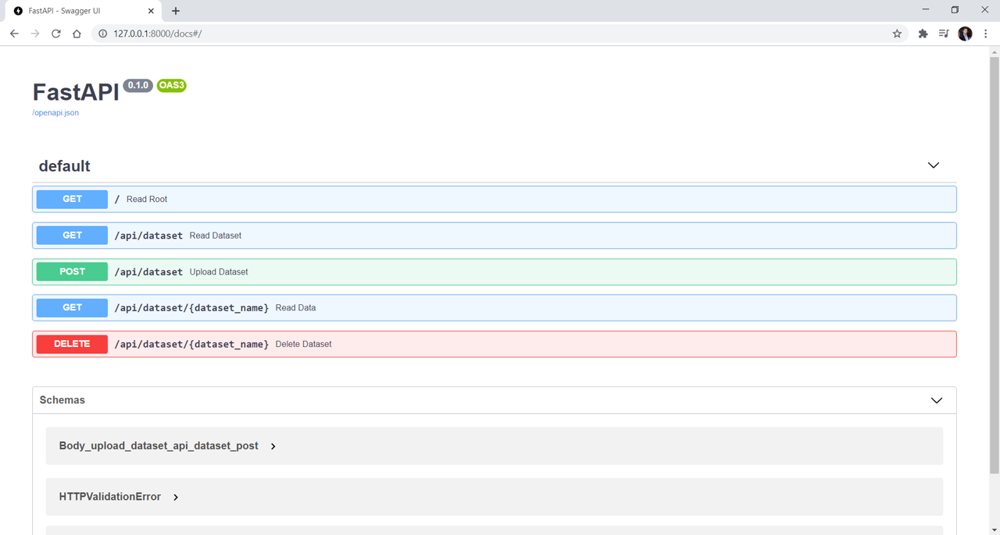

# Analytics server

A REST API to expose datasets with FastAPI
(previous version was with Flask & connexion)

This is the data manipulation performed by the server:


This command starts the server from the /app folder:
```
uvicorn main:app --reload
```

By default it will run the fastAPI server on port 8000:
[http://localhost:8000](http://localhost:8000)

You will be prompted by the following home template:


You will see the automatic interactive API documentation (provided by Swagger UI):
[http://localhost:8000/docs](http://localhost:8000/docs)



## Docker deployment

Build docker image

```
docker build -t analytics-server-image .
```

start docker container

```
docker run -d --name analytics-server-container -p 8000:80 analytics-server-image
```

## Inspiration
* [Python REST APIs With Flask, Connexion, and SQLAlchemy](https://realpython.com/flask-connexion-rest-api/#demonstration-single-page-application)
* [Migrate From Flask to FastAPI Smoothly](https://medium.com/better-programming/migrate-from-flask-to-fastapi-smoothly-cc4c6c255397)
* [Jinja Templates for FastAPI](https://fastapi.tiangolo.com/advanced/templates/)
* [Deploy FastAPI with Docker](https://fastapi.tiangolo.com/deployment/docker/)